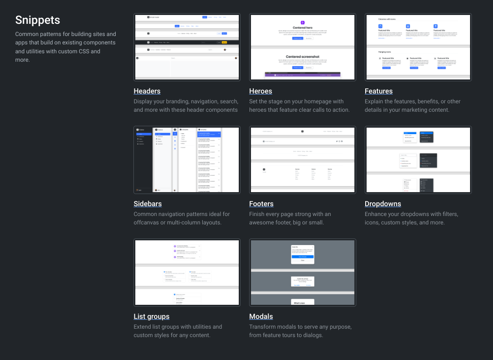

# Bootstrap v5.3 Snippets README

Bootstrap v5.03 snippets installed in VS Code for faster coding. This just adds the snippets included in the screenshot below to your VS Code. You can reference these on the [Examples site](https://getbootstrap.com/docs/5.3/examples/) for Bootstrap. I plan on adding the other "Custom Components" and more in the weeks to come. Stay tuned `:)`

## Features

This just adds a few handy bootstrap 5.3 example snippets to VS Code to make it faster to build sites.

> NOTE: This is only the beginning, if you jump on Discord I would be glad to implement whatever snippets you like.

## Requirements

VS Code

## Extension Settings

No needed settings. You can access and edit these snippets in `FILE > PREFERENCES > USER SNIPPETS and remove whatever you like. I may replace the default icons and svg from their site with placeholder.com images in the future updates.

## Release Notes

This is just the beginning of this extension for bootstrap templates.

## CHANGELOG 

View the changelog to see added snippets.

## Installation

### Locally

- Download the vsix file in this repo.
- Open VS Code.
- Click on the Extensions icon in the Activity Bar on the side of the window (or use the shortcut Ctrl + Shift + X on Windows/Linux or Cmd + Shift + X on macOS).
- Click on the ellipsis button on the top-right corner of the Extensions panel.
- Click on "Install from VSIX...".
- Navigate to the directory where your .vsiv file exists, and select the .vsix file.
- Click on "Open".
- Follow the instructions in the prompt to complete the installation.

Once the extension is installed, you should be able to access the custom code snippets.

### In VS Code

Open Extensions search "vscode-bs5-snippets" and install.

### VS Code Marketplace

[https://marketplace.visualstudio.com](https://marketplace.visualstudio.com/items?itemName=yosileyid.vscode-bs5-snippets)

## Contact Me

Feel free to reach out to me if you need help.